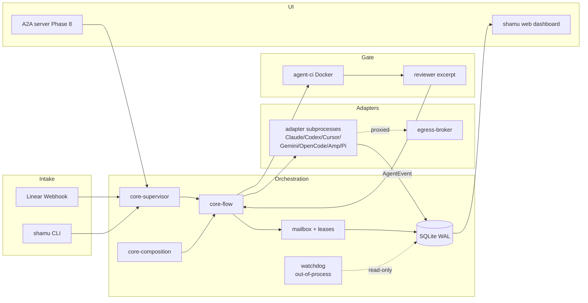

# Shamu — Architecture

This document describes how the Shamu monorepo is laid out, what each package
owns, and how a single run flows from Linear pickup to a merged patch. It is
the quick-orientation doc for a contributor who isn't sitting in an active
session; the living source of truth is [`PLAN.md`](../PLAN.md).

## System overview

A canonical run looks like this:

1. **Intake.** A Linear issue gets the `shamu:ready` label. Linear fires a
   webhook to `shamu linear serve`'s receiver (or `shamu linear tunnel`'s
   cloudflared route during dev). The receiver verifies HMAC, checks the
   timestamp window, consults the nonce cache, and drops unauthenticated or
   replayed requests.
2. **Pickup.** The daemon extracts the issue, flips the label to
   `shamu:in-progress`, creates a run row in SQLite, and opens a rolling
   comment on the Linear issue.
3. **Supervisor + flow.** The pickup driver calls `runFlowInProcess` against
   the `plan-execute-review` flow. The supervisor (`@shamu/core-supervisor`)
   owns child lifecycle; the flow engine (`@shamu/core-flow`) owns the DAG.
   Each node is resumable against its last completed output.
4. **Adapter spawn.** Per-role adapters spawn via `@shamu/adapters-base`.
   `SpawnOpts` carries the orchestrator-assigned `runId`, a `vendorCliPath`
   for pre-authenticated vendor CLIs, and supplemental env (typically
   `HTTPS_PROXY` / `HTTP_PROXY` pointing at the per-run egress broker).
5. **Events.** Every adapter yields an `AsyncIterable<AgentEvent>`. Events are
   redacted on first write (G1) and land in two tables: `raw_events`
   (vendor-verbatim, never re-derived) and `events` (normalized projection,
   migratable). The supervisor, watchdog, CLI, and web dashboard all
   subscribe to the same stream.
6. **Mailbox + leases.** Workers coordinate via `@shamu/mailbox` — SQLite is
   canonical, `.shamu/mailbox/<agent>.jsonl` is a materialized human-readable
   export. `from_agent` is stamped from the authenticated run context, never
   from the payload (G6). Advisory glob leases (`@shamu/mailbox/leases`)
   prevent pre-write races; the patch lifecycle's diff-overlap check catches
   semantic races git-merge misses.
7. **Patch lifecycle.** On a signed commit to `shamu/<run-id>`, the flow fires
   `@redwoodjs/agent-ci`. The wrapper in `@shamu/ci` parses `run-state.json`
   + per-step logs, derives run status from workflow + job statuses (never
   the fire-and-forget top-level field), strips ANSI, and projects failure
   excerpts for the reviewer. Red CI blocks the reviewer-approve transition.
8. **Integrate.** On green + approve, the flow runs the three-check reconcile
   (`git merge --no-commit` + `diffOverlapCheck` + rerun agent-ci) from
   `@shamu/core-composition`. On red post-merge, bisect-aware revert.
9. **Label flip.** Escalations (`EscalationRaised`) fan out to subscribed
   sinks; the Linear sink flips `shamu:blocked` on watchdog agreement, lease
   reclaim refusal, or three consecutive CI reds. On clean completion, the
   sink attaches the PR URL and flips `shamu:review`.

## Diagram

ASCII first. A Mermaid rendering follows for viewers that prefer it.

```
  Intake             Orchestration             Adapters           Gate             UI
  ======             =============             ========           ====             ==
  Linear webhook     +---------------+      +----------------+    agent-ci (Docker)
         |           | @shamu/core-  |      | @shamu/adapter-|    +---------+
         v           |   supervisor  |<---->|   claude/codex |    |         |
  +----------------+ |   +-core-flow |      |  cursor/gemini |--->| Redwood |
  | linear/webhook +-+---+core-      +----->|  opencode/amp  |    | agent-ci|
  |  HMAC + nonce  | |   |   compose |      |  pi/echo       |    |         |
  +----------------+ +---+-----------+      +----------------+    +----+----+
         |               |  |  ^                    ^                  |
         v               v  v  |                    |                  v
  +----------------+  +------+------+          +----+----+       events+CIRed
  | shamu CLI      |  | SQLite (WAL)|<---------+ egress- |       into flow
  |  run/flow/ui/  |  | runs events |          | broker  |             |
  |  linear attach |  | mailbox     |          +---------+             v
  +----------------+  | leases      |                            reviewer verdict
         |            | audit chain |                                  |
         v            | flow_runs   |                                  v
  +----------------+  +-------------+                           shamu/<run-id>
  | shamu web      |<-------SSE--------+                               |
  |  (127.0.0.1)   |                   |                               v
  +----------------+                   |                       3-check reconcile
                                       |                       (merge + overlap
  A2A (Phase 8.B)                      |                        + rerun CI)
  +----------------+                   |                               |
  | /.well-known/  |                   |                               v
  |   agent.json   |<--JSON-RPC+SSE----+                       integration branch
  |  Signed Cards  |  Bearer/EdDSA                                 |
  +----------------+                                               v
                                                         PR + Linear label flip
```

Five layers, left to right: **Intake** (Linear + CLI), **Orchestration** (core,
supervisor, flow, composition, persistence, mailbox, watchdog, worktree),
**Adapters** (vendor implementations + egress broker), **Gate** (agent-ci +
reviewer), **UI** (web dashboard + CLI tail + A2A surface).

Mermaid equivalent:



## Packages and responsibilities

Every workspace package ships from the monorepo. `@shamu/*` internal imports
are set up through `bun.lock` + `tsconfig` path mapping; no package publishes
to npm today.

| Package                              | Responsibility                                                                 | Public surface                                             |
| ------------------------------------ | ------------------------------------------------------------------------------ | ---------------------------------------------------------- |
| `@shamu/shared`                      | `Logger`, `Result`, branded IDs, Zod schemas, redactor, keychain abstraction   | `packages/shared/src/index.ts`                             |
| `@shamu/persistence`                 | SQLite schema + migrations + typed query helpers; `audit_events` HMAC chain    | `packages/persistence/src/index.ts`                        |
| `@shamu/adapters-base`               | `AgentAdapter` / `AgentHandle` / `SpawnOpts` contract + subprocess + contract suite | `packages/adapters/base/src/adapter.ts`               |
| `@shamu/adapter-echo`                | In-memory adapter for tests; passes full contract suite                        | `packages/adapters/echo/src/index.ts`                      |
| `@shamu/adapter-claude`              | `@anthropic-ai/claude-agent-sdk` adapter; in-process MCP injection             | `packages/adapters/claude/src/index.ts`                    |
| `@shamu/adapter-codex`               | `@openai/codex-sdk` adapter; thread resume; subscription cost reporting        | `packages/adapters/codex/src/index.ts`                     |
| `@shamu/adapter-opencode`            | `@opencode-ai/sdk` SSE-HTTP adapter; BYO provider keys                         | `packages/adapters/opencode/src/index.ts`                  |
| `@shamu/adapter-cursor`              | Cursor ACP-over-stdio; reuses `@shamu/protocol-acp` projector                  | `packages/adapters/cursor/src/index.ts`                    |
| `@shamu/adapter-gemini`              | Gemini CLI ACP variation on the shared projector                               | `packages/adapters/gemini/src/index.ts`                    |
| `@shamu/adapter-amp`                 | Sourcegraph Amp `--stream-json` long-lived shell                               | `packages/adapters/amp/src/index.ts`                       |
| `@shamu/adapter-pi`                  | `@mariozechner/pi-coding-agent` custom-JSONL over stdio                        | `packages/adapters/pi/src/index.ts`                        |
| `@shamu/core-supervisor`             | OTP-shaped `Supervisor` / `Swarm` / restart intensity                          | `packages/core/supervisor/src/index.ts`                    |
| `@shamu/core-flow`                   | Typed DAG engine (`AgentStep`, `Conditional`, `Loop`, `HumanGate`)             | `packages/core/flow/src/index.ts`                          |
| `@shamu/core-composition`            | Glue: `withEgressBroker`, `diffOverlapCheck`, escalation bridge, CI tripwire observer | `packages/core/composition/src/index.ts`            |
| `@shamu/mailbox`                     | Mailbox + advisory glob leases + pre-commit guard                              | `packages/mailbox/src/index.ts`                            |
| `@shamu/watchdog`                    | Out-of-process stuck detector; four signals + two-of agreement                 | `packages/watchdog/src/index.ts`                           |
| `@shamu/worktree`                    | `.shamu/worktrees/<run-id>` lifecycle + GC                                     | `packages/worktree/src/index.ts`                           |
| `@shamu/ci`                          | `agent-ci` wrapper: spawn, parse, reviewer excerpt, domain event projection    | `packages/ci/src/index.ts`                                 |
| `@shamu/egress-broker`               | Per-run HTTP(S) allow-list proxy; `policy.egress_denied` events                | `packages/egress-broker/src/index.ts`                      |
| `@shamu/linear-client`               | GraphQL client for issues / labels / comments / status                         | `packages/linear/client/src/index.ts`                      |
| `@shamu/linear-webhook`              | Bun HTTP server + HMAC verify + nonce cache + typed event union                | `packages/linear/webhook/src/index.ts`                     |
| `@shamu/linear-integration`          | Label state machine, rolling comment, escalation sink, CI tripwire             | `packages/linear/integration/src/index.ts`                 |
| `@shamu/protocol-acp`                | Shared ACP JSON-RPC client (stdio transport today)                             | `packages/protocol/acp/src/index.ts`                       |
| `@shamu/protocol-a2a`                | A2A v1.0 server + client; Signed Agent Cards; JSON-RPC + SSE                   | `packages/protocol/a2a/src/index.ts`                       |
| `@shamu/flow-plan-execute-review`    | Canonical planner → executor → reviewer flow                                   | `packages/flows/plan-execute-review/src/index.ts`          |
| `@shamu/cli`                         | `shamu` CLI (citty) — `run`, `flow`, `linear serve`, `ui`, `doctor`, ...       | `apps/cli/src/index.ts`                                    |
| `@shamu/web`                         | Dashboard (Hono + SolidJS + SSE); `startServer()` for CLI embedding            | `apps/web/src/server/index.ts` + `apps/web/src/frontend/`  |

## Adapter contract

Every vendor adapter implements the contract in
[`packages/adapters/base/src/adapter.ts`](../packages/adapters/base/src/adapter.ts):

- `vendor: string` + immutable `capabilities: Capabilities` loaded from a
  frozen manifest. Adapters cannot upgrade their own capabilities at runtime
  (G8).
- `spawn(opts: SpawnOpts) → Promise<AgentHandle>` and
  `resume(sessionId, opts)`. `SpawnOpts.runId` is orchestrator-assigned from
  Phase 2 onward; adapters must not mint their own.
- `SpawnOpts.env` threads proxy variables (`HTTPS_PROXY` / `HTTP_PROXY` /
  `NO_PROXY`) from the egress broker into the vendor subprocess.
- `SpawnOpts.vendorCliPath` lets pre-authenticated vendor CLIs skip env-var
  auth (validated on Phase 0.B).
- `AgentHandle.events` yields `AsyncIterable<AgentEvent>` with strictly
  monotonic `seq` per run. `interrupt`, `setModel`, `setPermissionMode`,
  `shutdown`, `heartbeat` round out the control surface.
- Path-scope and shell-AST gates (`path-scope.ts`, `shell-gate.ts`) are
  invoked from every adapter's permission handler before a tool executes.

The shared contract suite in `@shamu/adapters-base/contract` fans out as
`contract:<vendor>` jobs on every PR; `CI / ubuntu-latest` remains the sole
required check.

## Event taxonomy

Normalized `AgentEvent` kinds — see
[`packages/shared/src/events.ts`](../packages/shared/src/events.ts) and
[`PLAN.md` § Core architecture → 1](../PLAN.md):

- `session_start` / `session_end` — lifecycle; `source` ∈ `spawn | resume | fork`.
- `reasoning` — Claude `thinking` blocks / Codex `reasoning` items, optional signature.
- `assistant_delta` / `assistant_message` — streamed + final assistant turn.
- `tool_call` / `tool_result` — matched by `toolCallId`; payload-size tracked.
- `permission_request` — includes decision state for the pending-allow-deny-ask UX.
- `patch_applied` — file writes with add/del stats.
- `checkpoint` — progress marker read by the watchdog.
- `stdout` / `stderr` — subprocess streams surfaced for the reviewer.
- `usage` / `cost` — per-turn token + dollar signal with confidence metadata.
- `rate_limit` — informational budget signal (Claude emits natively).
- `interrupt` — requested-by metadata + delivery ack.
- `turn_end` — stop reason + duration.
- `error` — `fatal` + `retriable` flags for the supervisor.

Every event carries an `EventEnvelope` (ULID `eventId`, `runId`, `sessionId`,
`turnId`, `parentEventId`, monotonic `seq`, `tsMonotonic`/`tsWall`, `vendor`,
optional `rawRef` pointing back into `raw_events`).

## Protocols

**ACP (Agent Client Protocol).** JSON-RPC 2.0 over newline-delimited stdio
today. Shipped in Phase 7.B as the shared transport for Cursor and Gemini; the
projector lives at `@shamu/protocol-acp` (peer of `a2a`, not nested under
`adapters-base`) so a future ACP-over-HTTP transport or A2A bridge can reuse
it. Surface: `initialize`, `authenticate`, `session/new`, `session/load`,
`session/prompt`, `session/update` notifications, `session/request_permission`.
See
[`packages/protocol/acp/src/index.ts`](../packages/protocol/acp/src/index.ts).

**A2A v1.0 (Agent-to-Agent).** Landed in Phase 8.B. Signed Agent Cards (Ed25519
via `did:key`), JSON-RPC 2.0 over POST `/a2a`, SSE over POST `/a2a/stream`,
bearer-token auth via EdDSA JWS bound to the issuer DID. TOFU plus optional
allow-list for trust roots. `/.well-known/agent.json` serves the signed card.
Supervisor wiring — letting a remote A2A agent join a swarm — is a follow-on
track; the protocol library is self-contained. See
[`packages/protocol/a2a/README.md`](../packages/protocol/a2a/README.md).

## Boundaries you shouldn't cross

Package-level rules the existing READMEs and PLAN have been enforcing. Violate
these and the next parallel agent will fight your PR.

- **Vendor branching stays in `packages/adapters/<vendor>`.** `@shamu/adapters-base`
  is vendor-agnostic; the shared harness accepts per-vendor deltas via
  thin callbacks.
- **`@shamu/core-supervisor` knows nothing about Linear.** Escalations are local
  domain events; sinks subscribe. Linear wiring lives in
  `@shamu/linear-integration`.
- **Linear primitives vs composition.** `@shamu/linear-integration` exports
  primitives. The daemon-level composition (webhook + pickup + flow-run +
  rolling comment + escalation sink) lives in
  `apps/cli/src/services/linear-runtime.ts`.
- **`from_agent` is orchestrator-stamped, not writer-supplied.** The mailbox
  API signature takes no `from` parameter. Never add one (G6).
- **`runId` is orchestrator-owned.** Adapters accept it via `SpawnOpts`; never
  mint their own. The echo adapter's self-minted runId is Phase-1 legacy and
  still works under the contract only because echo is test-scoped.
- **Capabilities are immutable per adapter.** Declared at construction via
  `loadCapabilities`. Never vary across runs (G8).
- **`raw_events` is verbatim.** Redaction runs on first write (G1) but the
  table is never schema-migrated or re-derived. Projections rebuild `events`.
- **No dynamic SQL string building in `@shamu/persistence`.** Prepared
  statements only; a unit test greps the source for concatenation (T8).
- **Path-scope enforcement runs at tool-dispatch time (G4).** The pre-commit
  guard is defense in depth, not the primary control.
- **Shell AST gate uses `shell-quote`.** Default-reject `$()`, backticks,
  `eval`, pipes-to-shell, process substitution (G5).
- **`bun run lint && typecheck && test && agent-ci` all exit 0 before any
  commit.** No `--no-verify`, no `--no-gpg-sign`.
